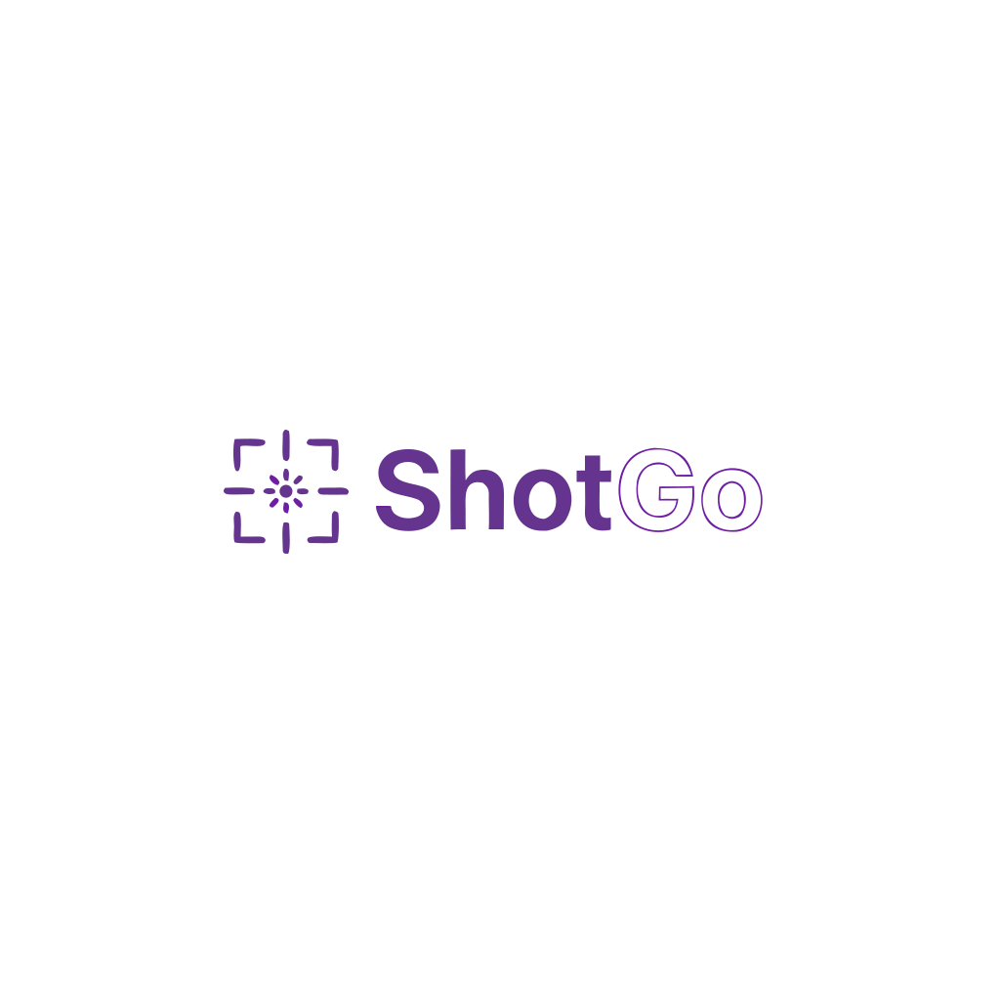

<p align="center">
  
</p>

<p align="center">
  Open-source screenshot and screen recording tool for macOS and Windows, built with Go and Wails.<br/>
  Inspired by CleanShot X and Lightshot — fast, lightweight, and free.
</p>

## Features

- **Screenshot** — fullscreen, region selection (native macOS crosshair), window capture
- **Screen recording** — MP4 and GIF output, max 5 minutes, ffmpeg-powered
- **Editor** — annotate with arrows, text, blur; crop; copy to clipboard or save
- **Global hotkeys** — configurable, system-wide shortcuts
- **System tray** — macOS menu bar icon with quick actions
- **Permissions** — guided onboarding for macOS Screen Recording permission

## Default Hotkeys

| Shortcut | Action |
|---|---|
| `Ctrl+Shift+1` | Capture fullscreen |
| `Ctrl+Shift+2` | Capture region |
| `Ctrl+Shift+3` | Start recording |
| `Ctrl+Shift+4` | Stop recording |

Hotkeys are configurable in Settings.

## Tech Stack

| Layer | Technology |
|---|---|
| Backend | Go 1.24, Wails v2 |
| Frontend | React 18, TypeScript, Zustand, Vite |
| Icons | Lucide React |
| Recording | Embedded ffmpeg |
| Tray (macOS) | CGo + NSStatusItem |
| Hotkeys | golang.design/x/hotkey |
| Linting | golangci-lint v2, oxlint, oxfmt, tsgo |
| Git hooks | Lefthook |

## Architecture

Clean Architecture with a strict **100 lines per file** rule.

```
internal/
├── domain/
│   ├── entity/      # Screenshot, Recording, Region, HotkeyConfig
│   └── port/        # Interfaces: Capturer, Recorder, Clipboard, etc.
├── usecase/         # CaptureFullscreen, StartRecording, SaveConfig, etc.
├── adapter/         # Platform-specific (darwin/windows) implementations
│   ├── capture/     # screencapture CLI (macOS), BitBlt (Windows stub)
│   ├── recorder/    # screencapture -v (macOS), DXGI (Windows stub)
│   ├── clipboard/   # pbcopy/osascript (macOS)
│   ├── hotkey/      # golang.design/x/hotkey + keymap
│   └── permissions/ # CGo CGPreflightScreenCaptureAccess (macOS)
├── infrastructure/
│   ├── ffmpeg/      # Encode MP4/GIF, extract binary from PATH
│   ├── storage/     # JSON config, file save to ~/Pictures/ShotGo
│   └── updater/     # GitHub Releases auto-update (stub)
└── app/             # Wails bindings, lifecycle, menu, tray
```

Frontend:

```
frontend/src/
├── stores/          # Zustand: app, capture, recording, settings, toast
├── hooks/           # useCapture, useRecording, useSettings, useEditorTools
├── components/
│   ├── editor/      # InteractiveCanvas, Toolbar, tools (arrow, text, blur, crop)
│   ├── recorder/    # RecorderControls with timer and pulsing dot
│   ├── settings/    # Grouped settings with inline hotkey re-binding
│   └── onboarding/  # Welcome screen with permission check
└── styles/          # Design tokens, button presets, layout helpers
```

## Prerequisites

- Go 1.24+
- Node.js 20+
- Wails CLI: `go install github.com/wailsapp/wails/v2/cmd/wails@latest`
- ffmpeg in PATH (for recording)
- macOS: Xcode Command Line Tools (`xcode-select --install`)

## Development

```bash
wails dev
```

Opens the app with hot reload. Frontend changes reflect instantly; Go changes trigger a rebuild.

## Download

Grab the latest release from [GitHub Releases](../../releases/latest):

| Platform | File |
|---|---|
| macOS (Apple Silicon + Intel) | `ShotGo-macOS-universal.dmg` |
| Windows x64 | `ShotGo-Windows-x64-Setup.exe` |
| Windows ARM64 | `ShotGo-Windows-arm64.exe` |

## Build

```bash
# macOS (universal binary: arm64 + amd64)
wails build -platform darwin/universal

# Windows x64
wails build -platform windows/amd64

# Windows ARM64
wails build -platform windows/arm64
```

Build scripts with signing support:

```bash
# macOS with DMG
./scripts/build-darwin.sh

# macOS with signing + notarization
./scripts/build-darwin.sh --sign --notarize

# Windows (amd64 or arm64)
.\scripts\build-windows.ps1 -Arch amd64
.\scripts\build-windows.ps1 -Arch arm64
```

## Pre-commit Hooks

Lefthook runs automatically on `git commit`:

| Hook | What it checks |
|---|---|
| `oxfmt` | TypeScript/TSX formatting |
| `oxlint` | TypeScript/TSX linting |
| `tsgo` | Type checking (Go-based TS compiler) |
| `golangci-lint` | Go linting (errcheck, govet, staticcheck) |
| `gofmt` | Go formatting |
| `file-size` | All files ≤ 100 lines |

Setup: `npm install && npx lefthook install`

## Configuration

Config is stored at `~/Library/Application Support/ShotGo/config.json` (macOS) or `%APPDATA%/ShotGo/config.json` (Windows).

Screenshots save to `~/Pictures/ShotGo/` by default.

## Platforms

| Platform | Arch | Installer | Status |
|---|---|---|---|
| macOS | Universal (arm64 + x86_64) | DMG | Working — capture, record, tray, hotkeys |
| Windows | x64 (amd64) | NSIS Setup | Scaffolded — adapters are stubs |
| Windows | ARM64 | Portable exe | Scaffolded — adapters are stubs |
| Linux | — | — | Not in MVP |

## Creating a Release

Tag and push to trigger the CI/CD pipeline:

```bash
git tag v0.1.0
git push origin v0.1.0
```

GitHub Actions will automatically:
1. Build macOS universal binary and create DMG
2. Build Windows x64 with NSIS installer
3. Build Windows ARM64 portable exe
4. Create a GitHub Release with all artifacts and auto-generated release notes

## Contributing

1. Fork the repo
2. Create a branch: `git checkout -b feat/your-feature`
3. Follow [Conventional Commits](https://www.conventionalcommits.org/)
4. Every file must be ≤ 100 lines
5. Pre-commit hooks must pass
6. Open a PR

## License

MIT — see [LICENSE](LICENSE).
